# Codex32 screen reference

This reference shows the Codex32 import, correction, fingerprint, loading and
backup screens in the experimental fork. Use it to recognize what the device is
asking you to check. For a step-by-step recovery, see the
[user flow guide](Codex32_User_Flow_Guide.md); for wallet setup and public share
QRs, see the [build and test guide](Codex32_Experimental_Build_and_Test.md).

**Public test data only. Never fund these example wallets.** All screenshots use
the public BIP93 codex32 test vector "NAME" (fingerprint `fab6868a`) or deliberately
damaged versions of it. The screen behavior applies to other compatible codex32
shares too. These are native 240x240 renders, with hardware mocked. Source hashes, checkout identity and the delta
from the historical `22ee79b` baseline identify the captured code in the image
manifest. See the build guide for the frozen runtime pin and device-test status.
These images are software renders, not device photos. UX6 physical checks passed
at 240x240; the later Keep Saved Share navigation change needs its own focused
physical check. The camera image is a placeholder.
Some menus scroll; screenshots show the initial viewport. Shared SeedSigner
screens are included where Codex32 changes their content. Button names can differ
in other languages. A fingerprint match is a 32-bit accidental-error check,
not authentication; verify the wallet policy and a known address as well.

## Import and share collection

| Screen | When it appears and what it means |
| --- | --- |
| **Load a Seed**<br>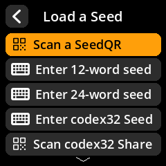 | Choose Enter codex32 Seed for numbered entry, or Scan codex32 Share for the camera. Scroll to see lower menu items. |
| **First share entry**<br> | Enter exactly 48 characters in numbered four-box groups. MS1 is locked; ? marks an unreadable character. Any of the three side buttons selects a keyboard character. |
| **An unreadable box**<br>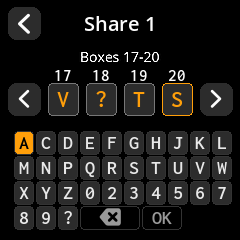 | Use ? only when a backup character cannot be read. It fills the box for entry, but cannot pass normal validation. A supported completion still needs review. |
| **Scan a share**<br>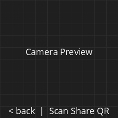 | Scan one Codex32 share QR. This illustration uses the generator's camera placeholder. Invalid scans use strict validation; correction proposals are a manual-entry feature. |
| **Share accepted**<br>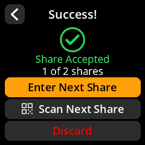 | A compatible split codex32 share has been accepted. Recovery requires the threshold number of distinct shares; this example shows one of two. Enter or scan the next share; Discard opens the discard confirmation. |
| **Next share entry**<br>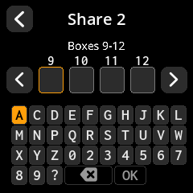 | MS1 plus the established threshold and identifier are locked for subsequent shares. The share index is the next editable position; enter a different index from the same set. |
| **Share Already Added**<br>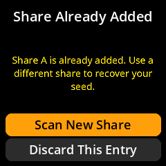 | This exact share is already saved. It adds no share toward recovery. Scan New Share opens the camera; Discard This Entry keeps the saved shares and lets you choose how to enter a different share. |
| **Share Conflict**<br>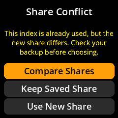 | Two checksum-valid strings use the same index but differ. Neither checksum identifies the correct backup. Compare Shares shows numbered differences. Check the original backup or an independent trusted record before choosing Keep Saved Share or Use New Share. Keep Saved Share returns to the scan-or-enter choice. If unsure, leave the saved share in place and investigate; do not guess. |
| **Compare Shares: page 1**<br>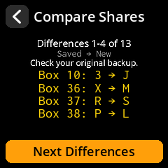 | Saved → New lists differing box values. Next Differences advances; Back returns one page or to the choice screen. Choose Share returns to the choices without accepting either copy. |
| **Compare Shares: page 2**<br>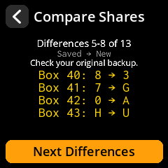 | Saved → New lists differing box values. Next Differences advances; Back returns one page or to the choice screen. Choose Share returns to the choices without accepting either copy. |
| **Compare Shares: page 3**<br>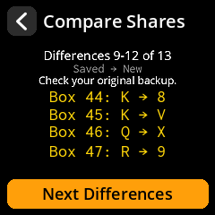 | Saved → New lists differing box values. Next Differences advances; Back returns one page or to the choice screen. Choose Share returns to the choices without accepting either copy. |
| **Compare Shares: page 4**<br>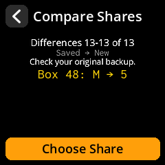 | Saved → New lists differing box values. Next Differences advances; Back returns one page or to the choice screen. Choose Share returns to the choices without accepting either copy. |
| **Discard all shares**<br>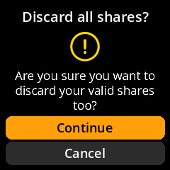 | Continue discards the collected shares. Cancel keeps the collection. This confirmation also appears when backing out of an accepted-share screen. |
| **Next share**<br>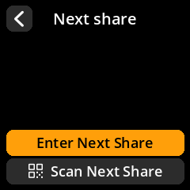 | After discarding an invalid entry or choosing Keep Saved Share, choose manual entry or scanning. Your accepted shares and their correction history remain saved. |
## Invalid entries

| Screen | When it appears and what it means |
| --- | --- |
| **Correction available**<br>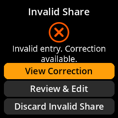 | A manual entry failed validation and a bounded proposal is available. View Correction starts review; Review & Edit keeps your original entry. The proposal has not been accepted. |
| **No Correction Found**<br>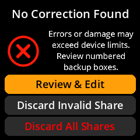 | No supported proposal was found. Errors or damage may exceed this device's limits; the true error count is unknown. Review numbered backup boxes, discard this entry, or discard the collection. |
| **Invalid share**<br>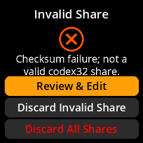 | A scanned share failed its checksum. Recheck the QR and backup. Manual correction availability is not implied by this scan error. |
| **Share set mismatch**<br>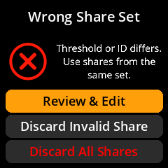 | The scanned threshold or identifier differs from the current set. Use shares from one matching set; do not change a header merely to make it fit. |
| **Invalid Share Header**<br>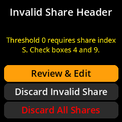 | Threshold 0 requires the secret index S. Check boxes 4 and 9. This specific message is used for the valid-checksum structural error. |
## Correction review and backup confirmation

| Screen | When it appears and what it means |
| --- | --- |
| **Review Correction: boxes 1-24**<br>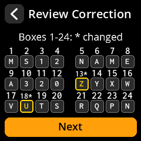 | Proposed characters appear in numbered boxes. Yellow boxes and * labels identify changes. Compare them with the original backup before continuing; the next stage shows entered-to-proposed pairs. |
| **Review Correction: boxes 25-48**<br>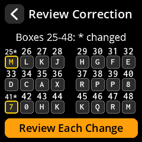 | Proposed characters appear in numbered boxes. Yellow boxes and * labels identify changes. Compare them with the original backup before continuing; the next stage shows entered-to-proposed pairs. |
| **Review Changes**<br>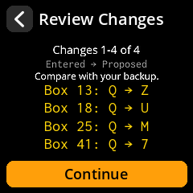 | Each line shows the box number and entered -> proposed character. Compare every pair with the backup before Continue. Up to four changes appear per page. |
| **More changes**<br>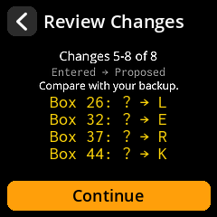 | For larger proposals, Next Changes advances through all affected boxes. Back returns to the previous group; Continue appears only on the last group. |
| **Where is the error?**<br>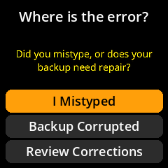 | Choose I Mistyped when the original backup is readable and agrees with the proposal. Choose Backup Corrupted if the paper needs repair. Review Corrections returns to the comparison pairs. |
| **Repair Backup**<br>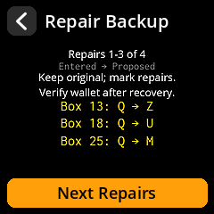 | Keep the original backup and mark the proposed repairs. Next Repairs shows remaining pairs. Readable repaired characters must be re-entered; repaired paper still requires independent wallet verification. |
| **Backup Ready**<br>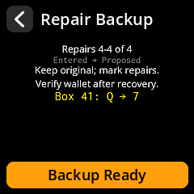 | After all repair pairs have been reviewed, Backup Ready opens the cleared correction boxes. Re-enter from the repaired backup; accepting that transcription does not independently verify the repair. |
| **Characters Unreadable**<br>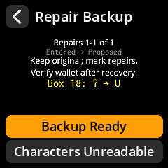 | If proposed ? replacements cannot be checked on the original backup, Characters Unreadable opens the reconstruction warning. Do not describe an unreadable replacement as verified from paper. |
| **Check Your Backup**<br>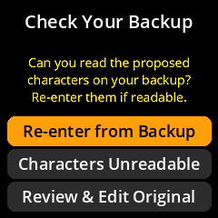 | After an entry containing ?, decide whether the proposed characters are now readable. Re-enter from Backup proves that transcription; Characters Unreadable takes the explicit reconstruction path. |
| **Re-enter changed boxes**<br>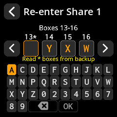 | Only affected boxes are cleared. Read the * boxes from your backup. Left/right arrows navigate affected groups; OK is selected when all required characters are entered. A re-entry must match the proposal exactly. |
| **Backup Differs**<br>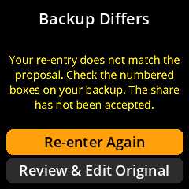 | The re-entered characters do not match the proposal, so the share has not been accepted. Re-enter Again retries the proof; Review & Edit Original returns to your initial transcription. |
| **Unverified Characters**<br>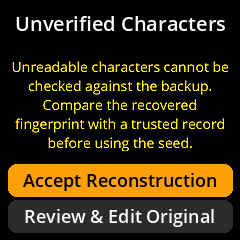 | Accept Reconstruction explicitly accepts characters you cannot compare with the backup. Their unverified status remains visible during fingerprint checking. A trusted prior record and wallet checks are needed. |
| **Large Recovery: 9 to 12 unknowns**<br>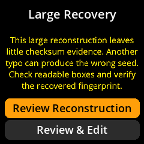 | Supported consecutive unknowns beyond eight leave reduced checksum evidence. Another typo outside the burst can give a wrong but valid proposal. Check readable boxes and independently verify the wallet. |
| **Large Recovery: 13 unknowns**<br>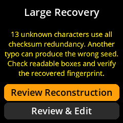 | Thirteen consecutive unknowns use all checksum redundancy. A valid completion does not verify the readable remainder. Review Reconstruction continues to the proposal; Review & Edit returns to the original entry. |
## Recovered seed and fingerprint checks

| Screen | When it appears and what it means |
| --- | --- |
| **Recovered Seed**<br>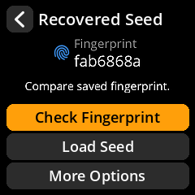 | After k compatible shares, or a direct S share, the seed fingerprint is available. Recovery means combining shares; it does not mean an error was corrected. Check a previously saved fingerprint, Load Seed, or open More Options. |
| **Share entry corrected**<br>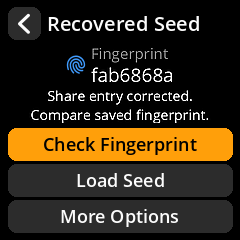 | Readable transcription errors were corrected and re-entered. The screen records that an entry was corrected; compare the fingerprint with a trusted prior record. |
| **Share repairs unverified**<br>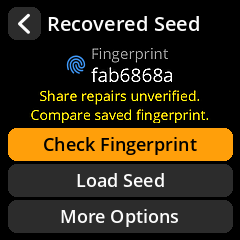 | One or more accepted repairs or unreadable characters lack independent verification. The yellow caveat remains separate from fingerprint-check status. |
| **Check Fingerprint**<br>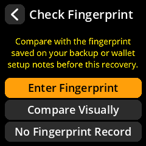 | Use a fingerprint saved before this recovery on a backup or wallet setup record. Enter Fingerprint checks eight hexadecimal characters; Compare Visually is optional; No Fingerprint Record explains next steps. |
| **Enter Fingerprint**<br>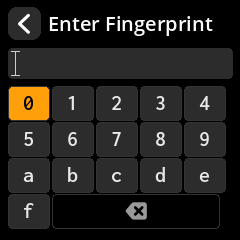 | Enter the eight characters from your existing record. All three side buttons select keys. The eighth character submits; Back cancels. Do not copy the new on-screen fingerprint and treat that as verification. |
| **Compare visually**<br>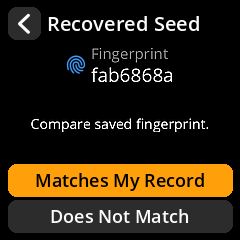 | Compare fab6868a with your existing record. Matches My Record or Does Not Match records your visual assessment. Optional typed entry avoids misreading similar characters. |
| **Record Matches**<br>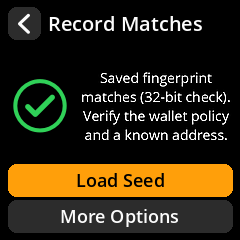 | The saved fingerprint matches. Load Seed continues to normal finalization; More Options opens recovery tools. A 32-bit match checks accidental errors and must be followed by wallet-policy and known-address verification. |
| **A match with unverified repairs**<br>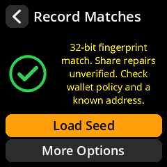 | The green check means the recorded fingerprint matched. The yellow Share repairs unverified caveat remains: the match does not prove every repair or authenticate the wallet. |
| **Visual match result**<br> | A confirmed visual comparison uses the same match screen and loading choices. It is your comparison with a prior record, rather than a typed equality check. |
| **Record Mismatch**<br>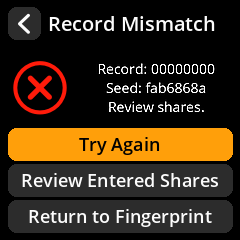 | The entered record differs from this recovered seed. Try Again checks the record entry; Review Entered Shares reopens the originals. This result does not offer Load Seed. |
| **Visual mismatch result**<br>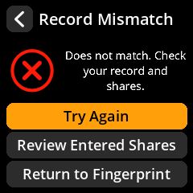 | Does Not Match leads to the same recovery-review choices, with a message to check your record and shares. |
| **Without a Record**<br>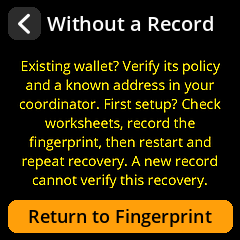 | For an existing wallet, compare policy and a known address in the coordinator. For first setup, check worksheets, record the fingerprint, then restart and repeat recovery. A newly written record cannot verify this first reconstruction. |
| **Return after a match**<br>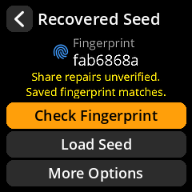 | After a typed match, Saved fingerprint matches appears alongside Share repairs unverified. Returning through More Options must preserve both independent facts. |
| **Return after visual comparison**<br>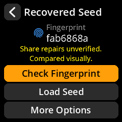 | Compared visually records the visual path. The repair caveat remains when present; it is not replaced by comparison status. |
## Recovery options and seed loading

| Screen | When it appears and what it means |
| --- | --- |
| **Recovery Options**<br>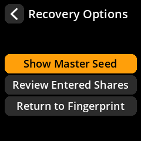 | More Options holds Show Master Seed, Review Entered Shares, and Return to Fingerprint. Back also returns to the fingerprint without discarding the current comparison marker. |
| **Review Entered Shares**<br>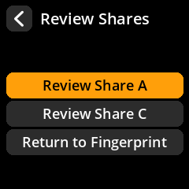 | Choose an originally entered share, including its original damaged transcription if available. Editing rebuilds recovery and resets the previous fingerprint comparison; other compatible shares are retained where applicable. |
| **Rebuild unreadable entry**<br>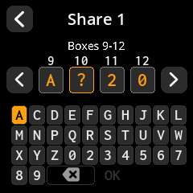 | Reviewing a share with ? reopens numbered entry at the unresolved boxes. Left/right navigate remaining unknowns. Replace every ? before OK; these boxes are edits to the original entry, not proof that a backup repair was verified. |
| **Master seed warning**<br>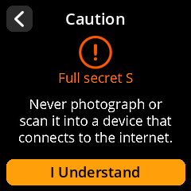 | Show Master Seed exposes the complete secret S. Protect a real secret from cameras and connected devices. This guide displays public test data only. |
| **Secret S: boxes 1-24**<br>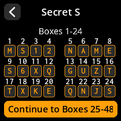 | The complete S string appears over two numbered pages. Top Back returns without forcing finalization. After the second page, Finalize Seed continues loading; a loaded-seed backup uses Confirm Backup instead. |
| **Secret S: boxes 25-48**<br> | The complete S string appears over two numbered pages. Top Back returns without forcing finalization. After the second page, Finalize Seed continues loading; a loaded-seed backup uses Confirm Backup instead. |
| **Finalize Seed**<br> | Load Seed, or Finalize Seed after display, reaches SeedSigner's standard finalization screen. Confirm the seed to proceed to its normal operations. |
| **Loaded seed**<br> | The loaded seed offers normal SeedSigner operations: export xpubs, address checks, signing and backup. Coordinator setup is explained in the experimental build and test guide. |
## Codex32 backup and QR export

| Screen | When it appears and what it means |
| --- | --- |
| **Backup Seed**<br> | For a Codex32 seed, choose View Codex32 Secret or Export as Codex32QR. These export the retained S/share metadata; they do not create new split shares. |
| **Select Share**<br> | Choose the derived secret S or an entered split share. S reveals the complete seed; a split share is not interchangeable with it. This menu is shared by display and QR export. |
| **Backup unavailable**<br> | Missing, invalid or inconsistent secret metadata prevents backup export. Re-import the original Codex32 secret to restore metadata; do not infer a new backup string from this warning. |
| **Backup metadata warning**<br> | Unverifiable split-share metadata has been omitted. Continuing exports only the valid secret S. This warning is about retained backup metadata, not proof that split shares were repaired. |
| **Confirm Backup after display**<br> | For an already loaded seed, the second numbered page offers Confirm Backup instead of finalizing another seed. |
| **Confirm codex32 backup**<br> | Optionally re-enter the displayed string to verify the new transcription. Done leaves this confirmation flow. It checks the exact selected share or S string. |
| **Backup re-entry**<br> | Re-enter the selected string through the numbered keyboard. Backup confirmation requires exact equality and does not accept an automatic correction. |
| **Backup confirmation failed**<br> | The transcription is invalid or differs from the selected original. Review & Edit reopens the entered boxes. |
| **Backup confirmation succeeded**<br> | The transcribed secret S matched the selected original. Confirming a split share reports that specific share instead; this is a transcription check. |
| **Codex32QR warning**<br> | A QR containing S is the full secret; a share QR contains that selected split share. Keep real backup QRs offline. The examples here contain public data only. |
| **Whole Codex32QR**<br> | View the selected string's full QR before transcription. The QR contains the plain Codex32 text, with no URI wrapper. |
| **Zoomed QR transcription**<br> | The enlarged QR section helps copy modules onto a paper grid. Navigate through the grid, then scan the completed copy for confirmation. |
| **Confirm Codex32QR**<br> | Scan the transcribed QR to compare its exact selected string. This checks your copied QR, not a wallet-policy or address record. |
| **Scan the copied QR**<br> | The confirmation camera compares the copied QR with the exact selected Codex32 text. Its preview is a placeholder in this reference. |
| **Split-share display warning**<br> | Selecting Share A changes the warning to identify that split share. Keep its index and threshold with the backup; it is not the complete secret S. |
| **Numbered split-share display**<br> | The same numbered display shows the selected share with a Share A title. This first page contains that share's header and data, rather than the secret S string. |
| **Split-share backup confirmed**<br> | The success message names Share A when its exact transcription matched. It confirms that selected split-share copy, not the whole recovered wallet. |
| **Split-share QR warning**<br> | Exporting Share A identifies that split share in the QR warning. A share QR and a secret S QR have different exposure consequences; verify the selection before copying. |
| **Wrong QR content**<br> | A readable QR does not match the expected selected string. Recheck whether you copied S or the intended split share. |
| **Invalid confirmation QR**<br> | The scanned QR is not a valid expected Codex32 backup. Review the grid and retry scanning. |
| **QR confirmation succeeded**<br> | The scanned copy matched the expected backup. Keep it with the correct share label and fingerprint/policy records. |

## Image provenance and regeneration

The [image manifest](img/screens/manifest.json) records each screenshot's View,
SHA256, size and the runtime-source hashes used to render it. Recreate them with
repository development dependencies installed:

```bash
python tools/render_codex32_screen_reference.py
```

The renderer takes only the fixed public fixtures in its source and makes no
release lookup or camera capture. Do not replace these illustrations with photos
or screenshots containing real backup data. Images illustrate individual states;
they do not replace navigation or hardware testing.
